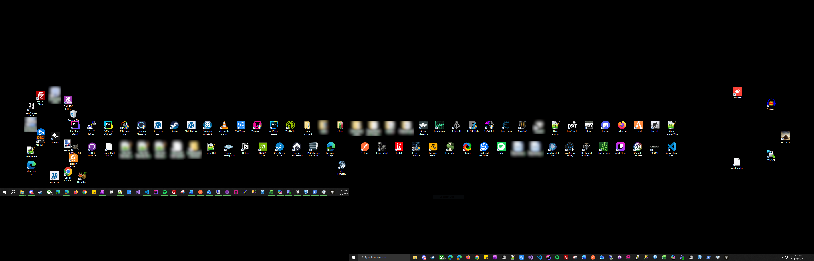

# SortBySchlong – Desktop Icon Shape Arranger for Windows

**Penetrate the monotony of your Windows workspace. 🍑**

SortBySchlong gives your Windows desktop icons a bit more… *structure.*  
It organizes them into a tasteful, vertically oriented geometric arrangement inspired by the classic silhouette you're probably imagining right now. 🤤



The debut release ships with a single arrangement engine:
- **PenisShapeProvider**  
  (Providing a firm foundation for future shapes)

---

## Features
- Programmatically rearranges desktop icons using Win32 ListView messages  
- Fully headless execution (the application keeps things discreet 🤫)  
- Extensible architecture designed to handle new shapes as they emerge  
- Future-ready scriptable layout system  
- Console harness for easy debugging and hands-on testing  
- Planned shell integration for one-click… sorting

---

## Solution Structure
```
/icon-arranger
  /src
    /IconArranger.Core              # Core engine, Win32 interop, shape logic
    /IconArranger.ConsoleHarness    # CLI runner for building and testing layouts
    /IconArranger.Shell             # (Future) C++ COM Explorer extension
  /docs
    ARCHITECTURE.md
    TESTING.md
    SHELL_INTEGRATION.md
    SHAPE_LANGUAGE_FUTURE.md
```

---

## Technologies
- **C# .NET 8** for core logic and the testing harness  
- **C++ Win32 COM** for the future Explorer context menu extension  
- **P/Invoke** for manipulating the desktop ListView window  

(That said, this application is capable of running only on Windows)

---

## System Requirements & Compatibility
- **OS:** Windows 10 or Windows 11  
- **Supports:** Single and multi-monitor setups  
- **Runtime:** .NET 8.0 or later  

SortBySchlong automatically identifies your primary desktop ListView and distributes icons proportionally, ensuring they stay neatly aligned regardless of your *width* or *height* configuration. 🫣

---

## Core Components

### Interfaces
- `IDesktopIconProvider` - gathers icon metadata  
- `IIconLayoutApplier` - updates icon coordinates  
- `IShapeProvider` - generates shape layouts with artistic intent  
- `IShapeRegistry` - manages shape providers  
- `IShapeScriptEngine` - placeholder for future custom “expressions”  

### Initial Implementations
- `DesktopIconService`
- `PenisShapeProvider`
- `ShapeRegistry`
- `NoopShapeScriptEngine` (premature for now)

---

## How the Engine Works
1. Detect desktop icons  
2. Measure the available… space 🚀
3. Generate layout points  
4. Reposition icons with careful, consistent alignment  

The initial invocation pattern:
```
ArrangeDesktopIcons("penis")
```
A simple call. A powerful result. 😏

---

## Console Harness Usage

The console harness provides direct access to the arrangement engine.

### Default execution
```bash
dotnet run --project IconArranger.ConsoleHarness
```

### Specify shape explicitly
```bash
dotnet run --project IconArranger.ConsoleHarness -- --shape=penis
```

### List available shapes
```bash
dotnet run --project IconArranger.ConsoleHarness -- --list-shapes
```

### Help
```bash
dotnet run --project IconArranger.ConsoleHarness -- --help
```

> ⚠️ *Note: Running this will reposition your actual desktop icons.  
Proceed only when fully ready for commitment.*

---

## Build Instructions

### Restore and build
```bash
dotnet restore
dotnet build -c Release
```

### Publish a self-contained executable
```bash
dotnet publish IconArranger.ConsoleHarness/IconArranger.ConsoleHarness.csproj   -c Release   -r win-x64   --self-contained true   /p:PublishSingleFile=true   -o ./publish
```

### Run tests
```bash
dotnet test
```

---

## Shell Extension (Future Work)

Planned enhancements include a Windows Explorer right-click entry that:

- Adds a `Sort by → Penis` option  
- Invokes the console harness behind the scenes  
- Provides instant, satisfying icon alignment

Full details appear in:
```
docs/SHELL_INTEGRATION.md
```

This integration will be added once the core engine is stable.

---

## Documentation
- **ARCHITECTURE.md** - component breakdown and design notes  
- **TESTING.md** - manual testing procedures  
- **SHELL_INTEGRATION.md** - plans for Explorer integration  
- **SHAPE_LANGUAGE_FUTURE.md** - early ideas for expressive, user-defined layouts  

---

## Disclaimer
SortBySchlong is a humorous yet fully functional tool.  
Handle with care - it may leave your desktop looking unexpectedly… organized. 🍑

Enjoy, refine, and extend.  
Symmetry awaits. 😈
